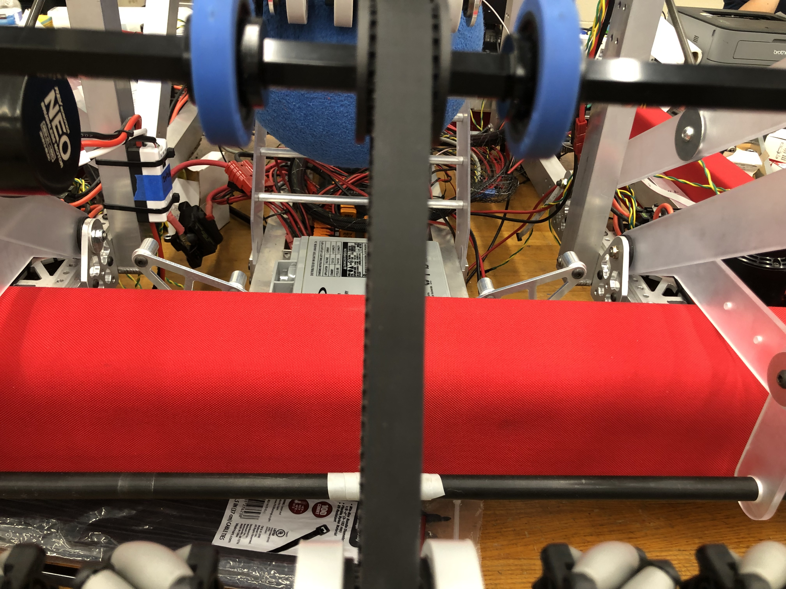

<div class="text-center p-4">
  
  
  
</div>

When I started highschool and went to the club fairs for the first time, I saw that there was a Robotics club. I was tempted to join, but decided against it because I thought that it would be too difficult and intimidating being by myself since none of my friends at the time were interested in Robotics. Then, after COVID, my engineering teacher approached me in my junior year to see if I would be interested in joining the Robotics team, along with my other friend who was in robotics previously. I hadn't known it at the time, but she was in the Robotics club in freshman year. Since I was still interested in it, I decided to join with her, along with another friend that we convinced to join with us. 

When I went to the introductory meeting, the advisors warned us that the club would be a lot of commitemnt, with studnents having to stay until late hours in the day from after school to midnight, and even a whole day after, where they would work on the robot until morning in severe cases. However, I still stayed despite this because I wanted to see for myself what the club was like and I thought the concept of building a robot was cool. 

When I officially joined, I was given 2 choices: join the mechanical team or the electrical team. The mechanical team would involve working on building and planning the compartments of the robot. Then, the electrical team would involve working on the electrical side of things, like combining wires and fiddling with a raspberry pi to control the robot. Then, even though I wanted to join the electrical team because it involved coding, I decided to join the mechanical team with my friend to even out the numbers since if I joined the electrical team, there would only be 2 people on the mechanical team. 

Micromouse is an event where small robot “mice” solve a 16 x 16 maze.  Events are held worldwide.  The maze is made up of a 16 by 16 gird of cells, each 180 mm square with walls 50 mm high.  The mice are completely autonomous robots that must find their way from a predetermined starting position to the central area of the maze unaided.  The mouse will need to keep track of where it is, discover walls as it explores, map out the maze and detect when it has reached the center.  having reached the center, the mouse will typically perform additional searches of the maze until it has found the most optimal route from the start to the center.  Once the most optimal route has been determined, the mouse will run that route in the shortest possible time.

For this project, I was the lead programmer who was responsible for programming the various capabilities of the mouse.  I started by programming the basics, such as sensor polling and motor actuation using interrupts.  From there, I then programmed the basic PD controls for the motors of the mouse.  The PD control the drive so that the mouse would stay centered while traversing the maze and keep the mouse driving straight.  I also programmed basic algorithms used to solve the maze such as a right wall hugger and a left wall hugger algorithm.  From there I worked on a flood-fill algorithm to help the mouse track where it is in the maze, and to map the route it takes.  We finished with the fastest mouse who finished the maze within our college.

Here is some code that illustrates how we read values from the line sensors:

```cpp
byte ADCRead(byte ch)
{
    word value;
    ADC1SC1 = ch;
    while (ADC1SC1_COCO != 1)
    {   // wait until ADC conversion is completed   
    }
    return ADC1RL;  // lower 8-bit value out of 10-bit data from the ADC
}
```

You can learn more at the [UH Micromouse News Announcement](https://manoa.hawaii.edu/news/article.php?aId=2857).
