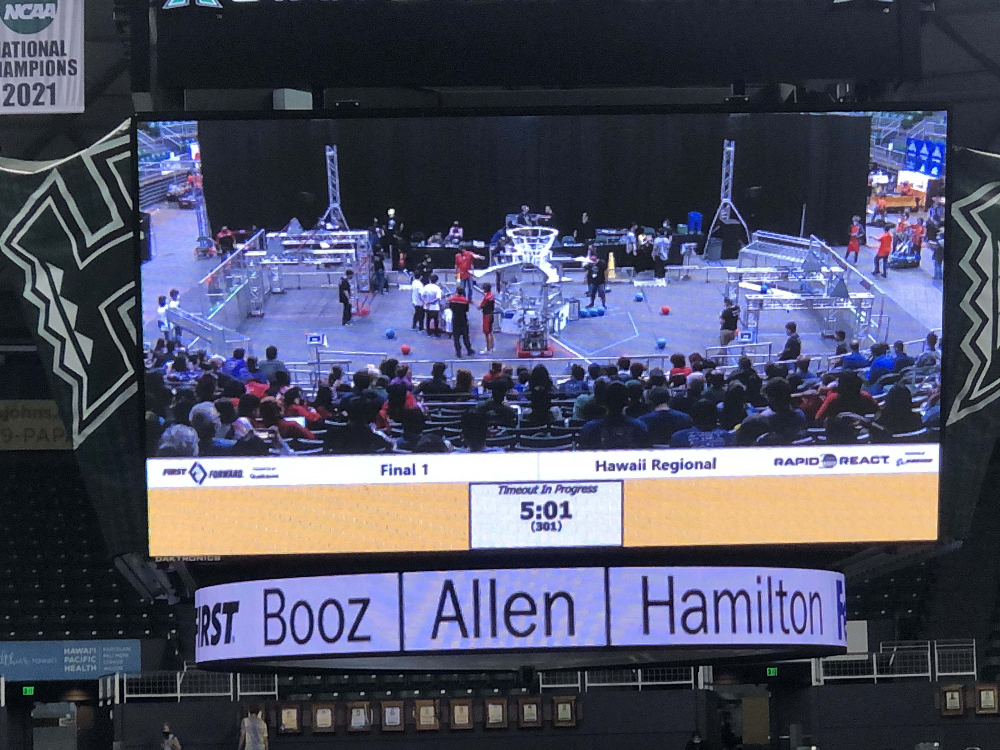
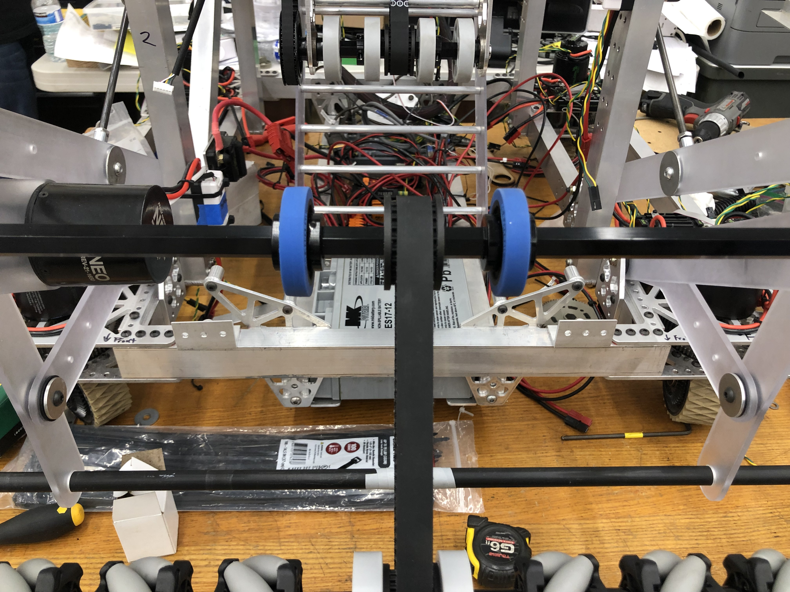

  

When I started highschool and went to the club fairs for the first time, one of the clubs that stood out to me was the robotics club. I was tempted to join, but decided against it because I thought that it would be too difficult and intimidating being by myself since none of my friends at the time were interested in robotics. My engineering teacher approached me in my junior year to see if I would be interested in joining the Robotics team along with my other friend (who was previously in robotics in our freshman year). Since I was still interested in robotics, I decided to join with her, along with another friend that we convinced to join with us. 

When I went to the introductory meeting, the advisors warned us that the club would be huge commitment, with students having to stay until late hours in the day from after school to evenings, and during crunch time before playoffs, we would possibly have to work on the robot until midnight or overnight. However, I still joined despite this because I wanted to see for myself what the club was like and I thought that getting to experience building a robot would be worth the commitement.

When I officially joined, I was given 2 choices: join the mechanical team or the electrical team. The mechanical team would work on assembling and planning the compartments of the robot, while the electrical team would involve working on the electrical side of things, like coding and fiddling with the raspberry pi to control the robot. I wanted to join the electrical team because the idea of coding a robot sounded cool. However, in the end, I decided to join the mechanical team with my friend to even out the numbers since joining the electrical team would mean that only two people would be working on the mechanical side of things. 

I had a difficult time adjusting to everything at first, since I had zero prior knowledge and experience using tools and machinery. I had to learn all of the terminology and specific uses for tools quickly since everything we did had to be finished before the competition time. However, once I tried using the tools first-hand, I was able to keep up with my team. 

For this project, I had to take measurements to make sure that all of the parts were able to fit together, then assemble the parts using mechanical tools, and plan and discuss with my team to form the designs of the body and functions of the robot. Then, my mentors would come in and take care of the more complex things like welding and laser cutting.

Overall, it was a difficult but rewarding experience. I had some regrets, like not trying out the electrical team and not being able to contribute to the best of my abilities due to my lack of knowledge, but I don't regret the time I spent in robotics because of the many things I learned and the fun I had. 

