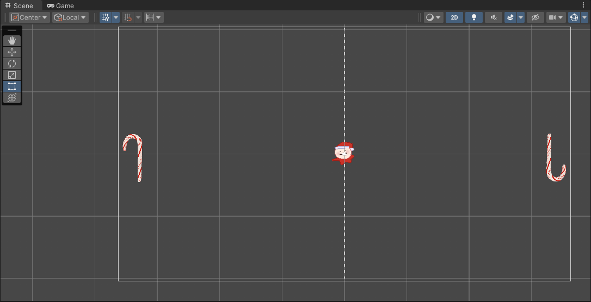

During the summer before my freshman year of entering university, I was still deciding on my major and what I wanted to do as a career. After some time and discussions with my family, I decided that I wanted to do computer science. This decisive moment motivated me to start on a game project since what initially inspired me to pursue programming was game development. However, I was a complete beginner and didn't how to start, so I followed a simple tutorial on how to build a pong game program using the Unity engine. I made assets for the game, as well as referencing code that was provided in the tutorial. I wanted to finish the project before school began, but I ran into some issues in coding the physics of the ball bouncing off the paddles and was unable to get it to work properly, so I left it unfinished until now and probably will leave it at that. Although it's left unfinished, it's one of the projects that introduced me to programming and that I found fun to work on. 

Below is some code that I've written for the program: 

Script for ball:

public class Ball : MonoBehaviour
{
    public float speed = 1000.0f;

    private Rigidbody2D _rigidbody;

    private void Awake()
    {
        _rigidbody = GetComponent<Rigidbody2D>();
    }
    private void Start()
    {
        AddStartingForce();
    }
    private void AddStartingForce()
    {
        float x = Random.value < 0.5f ? -1.0f : 1.0f;
        float y = Random.value < 0.5f ? Random.Range(-1.0f, -0.5f) : 
                                        Random.Range(0.5f, 1.0f);

        Vector2 direction = new Vector2(x, y);
        _rigidbody.AddForce(direction * this.speed);
    }
}
