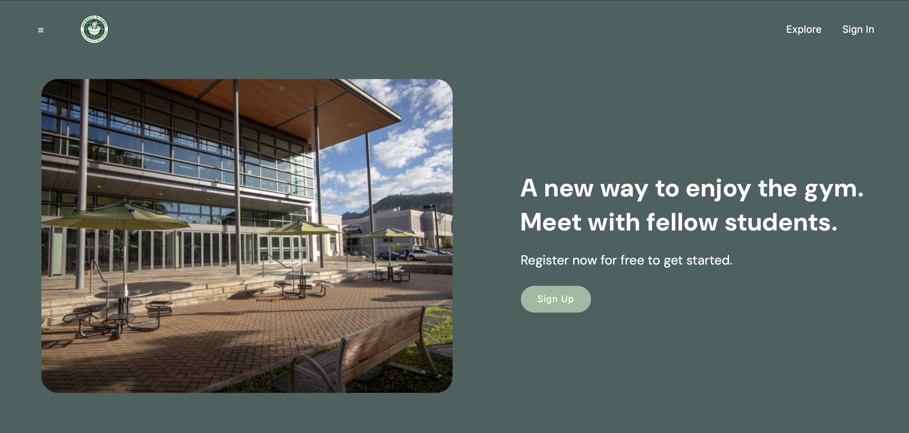

For my final project that I did for my ICS 314 class, I worked in a team of five to create a gym meetup website which would help students meet with other students to create a buddy system and support each other at the gym. It features a profile page, an exploration page, a calendar with all of the students' available times and a place where you can select different exercise options for each day, and a landing page where you can sign up and login. For this project, my main tasks were to create the homepage and the calendar page, and other things that I worked together with my team were the navbar and footer. 

From this project, I learned how to connect pages together, how to navigate and use the GitHub environment (Pull Requests, Issues, Merging Branches, etc.), things like React and Bootstrap, and how to collaborate effectively. One thing that I wished I had worked on more was the database. I felt more comfortable working on the UI and Javascript, but I feel like it would've been a good learning experience working on the back-end, which was unfortunate. However, I learned a lot from this project overall, and I got to work on a big coding project with a team for the first time. 

For more information on the project, check out our Github Organization for the source code: https://github.com/gym-meet

