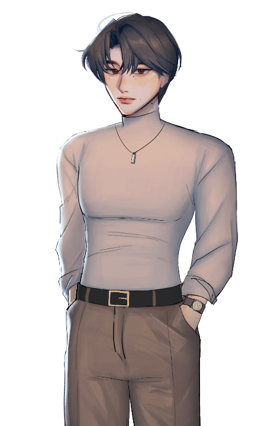
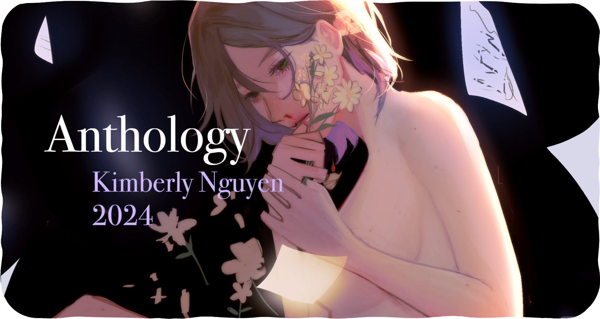

  
  
  

  

  

  

During my life, I've done a couple of art projects for contests, school, and just as a personal hobby.

I've included art that I've done for the Game Dev club at UH Manoa and my final Anthology Project for my ENG100 Class.

